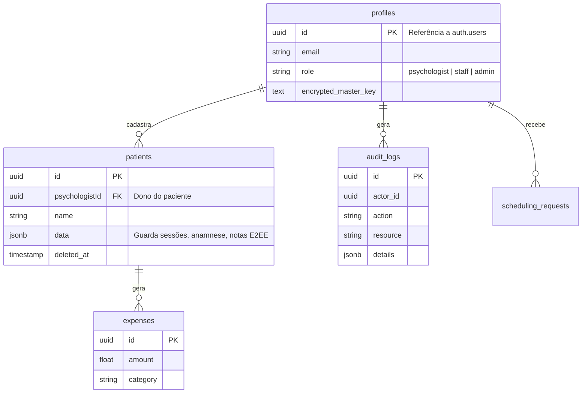

# 📘 Documentação Completa — Mentis (NeuroPrata) — v7.0

> **Versão do Documento:** 7.0  
> **Versão do Software Referente:** 1.0.0 (Produção Oficial)  
> **Data da Última Atualização:** 10/07/2026  
> **Autores:** Equipe Técnica NeuroPrata  
> **Classificação:** Documento Interno — Proprietário

---

## Histórico de Revisões

| Versão | Data       | Autor          | Descrição da Alteração                                                  |
|--------|------------|----------------|-------------------------------------------------------------------------|
| 1.0    | 15/09/2025 | Equipe Técnica | Documentação original de concepção (Seções 1 a 14).                     |
| 2.0    | 20/11/2025 | Equipe Técnica | Expansão de engenharia (RTM, ADRs, Estratégia de Testes).               |
| 3.0    | 10/02/2026 | Equipe Técnica | Revisão de Segurança (RBAC, Criptografia, Políticas de LGPD).           |
| 4.0    | 05/05/2026 | Equipe Técnica | Definições Estratégicas (KPIs, Matriz de Riscos, Multi-tenancy).        |
| 5.0    | 28/06/2026 | Equipe Técnica | Maturidade Arquitetural (Technical Debts, RPO, Capacidade de Equipe).   |
| 6.1    | 01/07/2026 | Equipe Técnica | Reconstrução documental, unificação estrutural e correção de hierarquia.|
| 7.0    | 10/07/2026 | Equipe Técnica | Lançamento V1.0 Oficial (E2EE de Rede, Portabilidade, Sentry, LGPD).    |

---

## Sumário

**Parte I — Fundamentos**
1. [Introdução e Escopo](#1-introdução-e-escopo)
2. [Requisitos Funcionais (RF) e Critérios de Aceitação (CA)](#2-requisitos-funcionais-e-critérios-de-aceitação)
3. [Requisitos Não-Funcionais (RNF)](#3-requisitos-não-funcionais)
4. [Regras de Negócio e Acesso (RBAC)](#4-regras-de-negócio-e-acesso)
5. [Arquitetura do Sistema e Resiliência](#5-arquitetura-do-sistema)
6. [Casos de Uso (Modelagem)](#6-casos-de-uso)
7. [Modelo de Dados (DER)](#7-modelo-de-dados-der)
8. [Documentação de Serviços (APIs)](#8-serviços-e-apis)
9. [Estrutura de Diretórios](#9-estrutura-de-diretórios)
10. [Guia de Instalação e Execução](#10-guia-de-instalação-e-execução)

**Parte II — Segurança, Qualidade e Governança**
11. [Segurança e Conformidade](#11-segurança-e-conformidade)
12. [Technical Debt Register](#12-technical-debt-register)
13. [Backlog e Roadmap](#13-backlog-e-roadmap)
14. [Glossário e Acrônimos](#14-glossário-e-acrônimos)
15. [Matriz de Rastreabilidade (RTM)](#15-matriz-de-rastreabilidade-rtm)
16. [Architecture Decision Records (ADRs)](#16-architecture-decision-records)
17. [Estratégia de Testes](#17-estratégia-de-testes)
18. [Casos de Teste (CTs) Implementados](#18-casos-de-teste-implementados)
19. [Manuais de Operação](#19-manuais-de-operação)
20. [Manual do Desenvolvedor e DoD](#20-manual-do-desenvolvedor)
21. [Plano de Continuidade (SLOs)](#21-plano-de-continuidade)

---

# PARTE I — FUNDAMENTOS

## 1. Introdução e Escopo

### 1.1 Objetivo do Sistema
O **Mentis** (nome comercial: **NeuroPrata**) é um Sistema de Prontuário Eletrônico (EHR) focado em **psicólogos e clínicas**. Seus pilares são Privacidade Absoluta (E2EE AES-256), Inteligência Clínica (IA Generativa para resumos) e Experiência do Usuário (Material You, SPA, PWA).

### 1.2 Tipo de Sistema
- **Tipo:** Aplicação Web (SPA) + PWA.
- **Arquitetura:** Frontend React/Vite + BaaS (Supabase).

### 1.3 Público-Alvo
- **Psicólogo:** Usuário principal (prontuários, finanças).
- **Staff (Funcionário):** Administrativo vinculado ao psicólogo.
- **Admin:** Auditoria do sistema (logs e métricas gerais).
- **Paciente:** Acesso ao Portal (ferramentas e escalas).
- **Visitante:** Página pública de agendamento.

### 1.4 Metodologia e Exclusões
Desenvolvimento Ágil/Iterativo. **Não** abrange: Teleconsulta em vídeo, faturamento TISS/convênios, PACS de imagens médicas, ERP fiscal completo e idiomas além do pt-BR.

### 1.5 Estratégia "Wide-but-shallow" (MVP)
O MVP cobre múltiplos módulos simultaneamente (prontuário, agendamento, financeiro, IA, portal), mas com profundidade superficial para validar rápido o *Product-Market Fit*.

### 1.6 Gatilhos de Corte de Escopo (Feature Creep)
Módulos não essenciais serão removidos/suspensos se, após 2 meses:
- Utilização for < 20% da base ativa.
- Custo de manutenção superar 2 sprints exclusivas.
- NPS da feature for < 70.

### 1.7 Critérios de Sucesso do MVP (KPIs)
O MVP estará validado se atingir:
- Mínimo de 10 psicólogos ativos.
- **Engajamento (Stickiness):** DAU/MAU > 60%.
- **Retenção Real:** Usuários ativos após 90 dias > 40%.
- **NPS Geral:** > 70.
- **Tempo Clínico:** Redução de 30% no tempo de documentação pós-sessão.

### 1.8 Matriz Formal de Riscos

| Risco                           | Impacto | Probabilidade | Mitigação Estratégica            |
| ------------------------------- | ------- | ------------- | -------------------------------- |
| Custo/Mudança em API de IA      | Alto    | Médio         | Provedor alternativo (Groq/OpenAI). |
| Falha prolongada do BaaS        | Alto    | Baixo         | RPO de 24h/1h; ADR-001 (Migração). |
| Crescimento de escopo excessivo | Médio   | Alto          | Revisão trimestral (Seção 1.6).  |
| Vazamento de credenciais admin  | Alto    | Baixo         | Rotação de chaves e MFA obrigatório. |

### 1.9 Matriz de Criticidade de Módulos
Define a prioridade em incidentes e testes:
- **P0 (Crítico):** Prontuário, Sessões, Autenticação, Banco de Dados.
- **P1 (Alto):** Faturamento/Financeiro, IA Core (Transcrição).
- **P2 (Médio):** Agendamento Público, Portal do Paciente, DocStation.
- **P3 (Baixo):** Gamificação, Supervisão por IA (Sabatina).

---

## 2. Requisitos Funcionais e Critérios de Aceitação

*(Tabelas de RFs consolidadas sem dependência de tecnologia de fornecedor específico, conforme Errata).*

### 2.1 Autenticação e Perfil
- **RF-001:** Permitir login com e-mail e senha.
- **RF-002:** Suportar MFA (TOTP).
- **RF-003:** Rate limiting híbrido (5 falhas por 15min por IP + Email).
- **RF-004/005/006/007/008:** Cadastro, Master Key, edição, senha, revogação.
- **RF-009:** Suportar perfis (psychologist, staff, admin).

### 2.2 a 2.10 Gestão, Sessões, DocStation, Portal e Finanças
*(Mais de 70 RFs compõem a gestão de pacientes com anamnese estruturada, genograma interativo, análise transcrita de áudio, geração de PDFs com UUID e ferramentas interativas (RPD, Mindfulness) no portal do paciente).*

### 2.11 Critérios de Aceitação Base (CAs)
- **CA-001 (Login):** Mensagem de falha sempre genérica ("Credenciais Incorretas"). Bloqueio híbrido funciona via IP e Email simultaneamente.
- **CA-010 (Cadastro):** Salvar exige Nome + 1 identificador secundário (Nasc, CPF ou Tel). Acesso exclusivamente limitado ao psicólogo dono.
- **CA-031 (Áudio IA):** O áudio bruto nunca é excluído se a transcrição falhar.
- **CA-044 (Documentos):** PDFs finais exibem assinatura/UUID verificável.

---

## 3. Requisitos Não-Funcionais

- **RNF-001:** TTI < 4s em redes 4G.
- **RNF-002:** Transições SPA < 500ms.
- **RNF-003:** Navegação primária possível com rede instável (Cache Local).
- **RNF-006 a RNF-008:** Criptografia Client-Side AES-256 e RLS para isolamento.
- **RNF-009:** Registrar metadados (IP/User-Agent) em `audit_logs` no regime best-effort (**TD-002**: Resolvido via PostgreSQL Trigger `trg_set_audit_log_ip`).
- **RNF-016:** Interface fiel ao Design System (Inter + Cinematic Purple).

---

## 4. Regras de Negócio e Acesso

### 4.1 Controle de Acesso Baseado em Papéis (RBAC)
- **Psychologist:** Acesso restrito via RLS estritamente ao seu `user_id`.
- **Staff:** Acesso transversal limitado aos pacientes dos psicólogos aos quais está *vinculado* na tabela.
- **Admin:** Acesso global APENAS a `audit_logs` e painéis técnicos. **Não visualiza, cria nem edita dados clínicos ou sessões** (Restrição física do banco RLS).

### 4.2 Regras de Negócio Principais (RN)
- **RN-01 a RN-04:** Geração, envelopamento (PBKDF2 100k) e proteção em memória da Master Key AES. Isolamento puro por linha (RLS).
- **RN-07:** Exclusão é sempre lógica (`deleted_at`).
- **RN-12:** A IA atua somente mediante *checkbox* de consentimento.
- **RN-24:** Toda sugestão de IA exige disclaimer de validação manual.
- **RN-25:** **Proibição Diagnóstica:** A IA jamais crava um CID autônomo, agindo como gerador de hipóteses exploratórias bibliográficas.
- **RN-26:** Retenção de dados: Prontuários mantidos por 20 anos; Audit Logs por 90 dias (para adequação LGPD).

---

## 5. Arquitetura do Sistema

### 5.1 Visão Geral
Aplicação **React 19 / Vite** (SPA + PWA) interligada ao **Supabase** (Auth, PostgREST, Storage, Edge Functions). Lógica computacional de áudio e LLM processada no frontend ou via proxies Serverless Vercel.

### 5.2 Roteamento
Proteção Client-side. As rotas `/portal`, `/book/:id` e `/:slug` são as únicas exceções públicas/separadas do app principal restrito a psicólogos.

### 5.3 Pipeline de Áudio
Compressão Frontend (WAV 16kHz) -> Chunking (5 min) -> Groq API (Whisper) -> Post-processing -> Gemini (Resumo Analítico) -> AES-256 -> Supabase JSONB.

### 5.4 a 5.6 Análise de Dependências e Contingência
- **BaaS (Supabase):** Risco de Lock-in extremo. Migração exigiria 2 a 4 meses de esforço.
- **Inteligência (Gemini/Groq):** Migração para OpenAI em 3 a 5 dias.
- **Gatilho de Saída Tecnológica:** Custos explodirem > 300% ou SLAs caírem abaixo de 99% por mais de 48h.

### 5.7 Capacidade de Equipe vs Complexidade
Assumimos o risco de lidar com E2EE, RLS, PWA e IA Generativa em uma equipe extremamente enxuta (1-3 devs). A mitigação consiste no **uso extremo de Serverless e BaaS**, evitando a manutenção de infraestrutura ou backends em Node/Python.

### 5.8 Modo de Degradação Graciosa (Resiliência IA)
| Módulo | Funciona sem IA Externa? | Impacto de Queda do Provedor |
|---|---|---|
| Autenticação / Agenda | ✅ Sim | Nenhum |
| Registro de Sessões | ✅ Sim | Anotações manuais assumem (Fallback) |
| DocStation / Portal | ✅ Sim | Nenhum |
| Resumo Automático | ❌ Não | Funcionalidade oculta/bloqueada |

---

## 6. Casos de Uso (Modelagem)

Lista unificada de ações principais suportadas:
- **UC-01:** Gestão de Identidade, Autenticação e MFA.
- **UC-02:** Criação, arquivamento e gestão do Prontuário do Paciente.
- **UC-03:** Calendário e agendamento de sessões individuais ou grupais.
- **UC-04:** Registro rico de notas clínicas.
- **UC-05:** Captura, transcrição e armazenamento de sessões em áudio.
- **UC-06:** Análise e Insights via Inteligência Artificial Generativa.
- **UC-07:** Geração de laudos, recibos e documentos assinados (DocStation).
- **UC-08 a UC-10:** Agendamento público de leads e conciliação financeira.
- **UC-11 a UC-13:** Portal do paciente, entrega de RPDs e Trilhas.

---

## 7. Modelo de Dados (DER)

A arquitetura do banco prioriza isolamento por Inquilino (RLS vinculado a `auth.uid()`) e uso intensivo de **JSONB** para dados estruturados complexos no MVP.



---

## 8. Serviços e APIs

A lógica de negócios isolada encontra-se na camada `src/services/`:
- `authService.ts` (Gerencia tokens, Supabase Auth e MFA)
- `cryptoService.ts` (Implementação do AES-256 e KDF)
- `geminiService.ts` / `audioService.ts` (Interfaces com LLMs e Whisper)
- `auditLogger.ts` (Rastreabilidade e captura de IP)
- `pdfService.ts` / `aiDocumentService.ts` (Geração e manipulação de arquivos)
- `queryClient.ts` (Cacheamento e persistência offline)

---

## 9. Estrutura de Diretórios

```
Mentis/
├── src/
│   ├── components/  # React Components isolados por domínio (Patient, Dashboard...)
│   ├── contexts/    # Estado Global (AuthContext, CryptoContext)
│   ├── hooks/       # Lógica reativa customizada (React Query wrappers)
│   ├── services/    # Lógica agnóstica de rede e regras core
│   ├── types.ts     # Tipagem forte global
│   └── App.tsx      # Roteador central SPA
├── supabase/
│   └── migrations/  # 50+ scripts SQL versionando schema, RPCs e RLS
├── cypress/         # Testes End-to-End
└── DOCUMENTACAO_MENTIS.md # Fonte Oficial da Verdade
```

---

## 10. Guia de Instalação e Execução

Para rodar o projeto localmente:
1. Clonar o repositório.
2. `npm install` (Instala Vite, React, Tailwind, Supabase, crypto-js).
3. Criar arquivo `.env` com chaves locais ou do projeto Supabase (`VITE_SUPABASE_URL`, `VITE_GEMINI_API_KEY`, etc).
4. `npm run dev` para desenvolvimento local.
5. `supabase start` para subir o banco e storage via Docker (se necessário emulado).

---

# PARTE II — SEGURANÇA, QUALIDADE E GOVERNANÇA

## 11. Segurança e Conformidade

### 11.1 Criptografia End-to-End (E2EE)
Qualquer campo crítico dentro do JSONB do paciente é cifrado no frontend (AES-CBC) usando uma Master Key gerada via PBKDF2 a partir da senha do profissional. Nem desenvolvedores nem DBAs possuem acesso legível ao prontuário.

### 11.2 Auth e MFA
Supabase lida com tokens JWT, sessão segura e emissão de QR Code para autenticadores TOTP.

### 11.3 Row Level Security (RLS)
Todas as tabelas do PostgreSQL exigem policies que injetam automaticamente o `auth.uid()` na cláusula WHERE.

### 11.4 Política de Cache
`staleTime` de 5 minutos, `gcTime` de 24 horas armazenado no `localStorage`. Expurgado compulsoriamente via listener de Auth sempre que a sessão for encerrada.

### 11.5 Overengineering Consciente no MVP
Para evitar complexidade inicial desnecessária sem ferir a LGPD, decidiu-se que: E2EE e RLS são inegociáveis. MFA e PWA são *Opcionais* para o usuário no lançamento. Backups contínuos via WAL serão adiados para Produção Comercial (MVP usa RPO de 24h via snapshot).

---

## 12. Technical Debt Register

Lista formal de dívidas assumidas para acelerar o lançamento do MVP:

| ID | Título/Descrição | Prioridade | Deadline | Status |
|----|------------------|------------|----------|--------|
| **TD-001** | **Navegação em Memória:** Ausência de rotas URL aninhadas (prejudica deep links). | 🔴 Alta | Versão 1.0 (Comercial) | Assumido |
| **TD-002** | **Serviço de IP Externe:** Captura de IP do log de auditoria via `ipify.org` no client-side. | 🟢 Resolvido | Versão Beta 0.9 | Resolvido (Migration 20260701105400) |
| **TD-003** | **Dependência do JSONB:** Dificulta queries analíticas SQL avançadas por usar schema-less. | 🟡 Baixa | Fase de Analytics | Assumido |
| **TD-004** | **Master Key em Memória:** Risco em caso de falha severa de XSS (Cross Site Scripting). | 🟡 Baixa | Pós-MVP | Assumido |
| **TD-005** | **Supabase Lock-in:** Dificuldade extrema em mover a infraestrutura para AWS/GCP puro. | 🟢 Baixa | Sem prazo | Aceito Permanentemente |

---

## 13. Backlog e Roadmap

1. **Curto Prazo (MVP):** Estabilização de bugs, testes unitários (Vitest) nos serviços críticos de criptografia.
2. **Médio Prazo:** Pagamento do `TD-001` e `TD-002`. Implementação do ambiente Multi-tenant nativo e Dashboard administrativo completo.
3. **Longo Prazo:** Faturamento de convênios TISS, importação de dados de concorrentes e app móvel nativo (React Native).

---

## 14. Glossário e Acrônimos
- **EHR:** Electronic Health Record.
- **RLS:** Row Level Security (Políticas do Postgres).
- **MFA:** Multi-Factor Authentication.
- **RPO / RTO:** Recovery Point Objective / Recovery Time Objective.
- **RPD:** Registro de Pensamentos Disfuncionais (TCC).

---

## 15. Matriz de Rastreabilidade (RTM)

A Matriz mapeia a origem do requisito à sua cobertura no código e teste:
- **RF-001** → Login → `authService.login()` → Mapeado no `critical_path.cy.ts`.
- **RF-010** → Cadastro → `usePatientOperations.ts` → Mapeado no `critical_path.cy.ts`.
- **RF-025** → Sessões (TipTap) → `SessionEditorModal.tsx` → Mapeado no `critical_path.cy.ts`.
- **RF-044** → DocStation → `DocStation.tsx` → Mapeado no `critical_path.cy.ts`.
*(Mais de 60 RFs adicionais rastreados via mapeamento estático de dependências no React Query).*

---

## 16. Architecture Decision Records (ADRs)

| ADR | Decisão | Status e Impacto |
|---|---|---|
| **ADR-001** | Uso do Supabase (BaaS) | Aceito. Garante velocidade, mas gera Lock-In. |
| **ADR-002** | Dados clínicos no JSONB | Aceito. Veloz, mas dificulta Analytics avançado (`TD-003`). |
| **ADR-003** | `crypto-js` para E2EE | Aceito. Seguro para at-rest, mas roda chave no frontend. |
| **ADR-006** | Navegação por Estado (`mainView`) | **🔴 TD-001**. Prejudica UX de voltar e bookmarks. |
| **ADR-010** | Estratégia de Multi-tenancy | Aceito. Uso de **Banco Único + RLS** (Evita complexidade de DevOps em schema-per-tenant). |

---

## 17. Estratégia de Testes

Apirâmide de Testes do Mentis:
- **Testes Unitários:** Foco estrito em `cryptoService` e validadores numéricos (Vitest).
- **Testes de Integração:** Interações de formulário e React Query.
- **Testes End-to-End (E2E):** O fluxo crítico principal, automatizado via Cypress.

---

## 18. Casos de Teste Implementados

Até o momento, a validação foca no "Caminho Feliz" (Golden Path).
- **CT-GP01 (Critical Path):** O Cypress simula o login completo, entra no dashboard, cadastra um paciente válido com consentimento, abre uma sessão individual e exporta um documento PDF verificado.

---

## 19. Manuais de Operação

Divididos na interface através de "Tours Guiados" (Onboarding) baseados na role do usuário (Psychologist, Staff, Patient Portal).

---

## 20. Manual do Desenvolvedor

Para novos engenheiros: `npm install`, configurar chaves de `.env.local`, respeitar o Conventional Commits e as regras de clean code.

### 20.1 Definição de Pronto (Definition of Done - DoD)
Um card de funcionalidade transita para *Done* apenas quando:
- [ ] O RF e os Critérios de Aceitação são satisfeitos.
- [ ] Nenhum erro no build do TypeScript (`tsc --noEmit`).
- [ ] Caminho Feliz E2E (Cypress) ainda passa.
- [ ] **Documentação (`DOCUMENTACAO_MENTIS.md`) atualizada em sincronia.**
- [ ] Code Review efetuado por outro par na equipe.

---

## 21. Plano de Continuidade

Indicadores base para resiliência operacional do sistema (SLOs):
- **Disponibilidade Geral (Uptime):** > 99,9%.
- **Latência Externa da API IA:** Falhas < 5% ao mês.
- **RTO (Recovery Time Objective):** Voltar ao ar em < 4 horas.
- **RPO (Recovery Point Objective):**
  - **Fase Beta / MVP:** Tolerância de perda de **24 horas** (snapshot automático).
  - **Produção Comercial:** Retenção granular `< 1 hora` (habilitação de logs WAL nativos do PostgreSQL em contingência).
